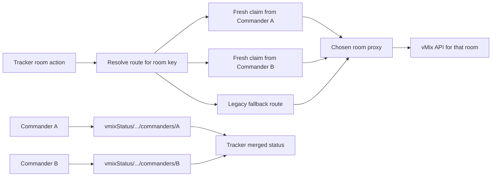

# Multi-Commander Routing Hardening Design

**Date:** 2026-05-17  
**Repos:** `/Users/alex/vmix-commander`, `/Users/alex/kubecon-tracker`

## Goal

Make one Tracker event work correctly with multiple live Commander instances on separate venue networks, so each room can:

- publish status from the Commander that can actually reach it
- receive control commands through that same reachable Commander
- remain operable even when other Commanders are on different private networks

The design must preserve backward compatibility with the existing single-Commander deployment path while removing the remaining single-controller assumptions that break the real event workflow.

## Current Failure Mode

The system has already moved partway from a single-Commander design to a multi-Commander design:

- Commander writes per-Commander status under `vmixStatus/<eventId>/commanders/<commanderId>`.
- Tracker merges those status cells so all rooms can appear healthy at once.
- Commander writes a room proxy claim when it can reach a room.

However, several paths still behave as if only one Commander owns the whole event:

1. Tracker UI enablement and fallback polling still depend on the old global proxy URL in some places.
2. The shared `roomProxies/<roomKey>` slot is last-writer-wins rather than representing all available routes.
3. Commander conflict detection still warns on any second Commander instead of only meaningful overlap.
4. Some room reconciliation flows still rewrite the entire shared `vmixRooms` array, allowing one client to clobber another client's room/IP changes.

This produces the observed symptom: all rooms can look healthy in Tracker while only the room reachable from the currently-selected shared proxy can actually be controlled.

## Chosen Approach

Use a backward-compatible **multi-route per room** model while keeping the current array-based `vmixRooms` schema for now.

### Why this approach

- It matches the physical deployment: one Commander per room/network is valid.
- It fixes the event-day workflow without a risky full schema migration.
- It preserves rollout compatibility for older Tracker / Commander versions through existing global-proxy fallbacks.
- It creates a clean path for a later key-addressed room schema migration if needed.

## Architecture

### 1. Room route ownership

Commander will publish route claims under:

```text
events/<eventId>/roomProxyClaims/<roomKey>/<commanderId>
```

Each claim contains:

```ts
{
  url: string;
  commanderId: string;
  updatedAt: number;
}
```

Each Commander owns only its own child cell and removes only that cell on disconnect, event switch, unlink, or loss of room reachability.

For backward compatibility during rollout, Commander may continue writing the legacy single winner cell:

```text
events/<eventId>/roomProxies/<roomKey>
```

but Tracker will prefer `roomProxyClaims` whenever it exists.

### 2. Tracker route selection

For each room, Tracker will choose a proxy in this order:

1. freshest valid route from `roomProxyClaims/<roomKey>/*`
2. legacy `roomProxies/<roomKey>` route if fresh
3. event-scoped `config.vmixProxyUrl`
4. global `vmix_proxy_url`

Freshness remains time-based so stale claims cannot keep a route alive indefinitely.

Tracker will use the resolved per-room route consistently for:

- button enablement
- command dispatch
- fallback status polling
- user-facing warning text

This removes the contradiction where a room can be shown green yet buttons are disabled because only the old global proxy is considered.

### 3. Multi-Commander control semantics

Multiple Commanders connected to the same event are valid.

Commander should warn only when a new Commander overlaps meaningfully with another live Commander on the **same room scope**, not merely because another Commander exists somewhere in the event.

The shared `controller` node remains as a legacy compatibility mirror, but presence-aware logic becomes the source of truth for detecting live peer Commanders.

### 4. Room sync hardening

Keep `config.vmixRooms` as the canonical room list for now, but reduce destructive writes:

- Operator reconciliation should upsert missing rooms surgically instead of replacing the whole room array.
- Admin reconciliation should continue converging on shared room identities and preserve remote IP values.
- Targeted IP writes remain per-room, with no unrelated room rewrites.

This keeps the current UI/data shape stable while eliminating the most likely clobber paths.

### 5. Diagnostics and operability

The apps should make the selected route visible in logs so field debugging is quick:

- Commander logs which event/room claim it published or removed.
- Tracker logs which route it selected for each room command and fallback poll.

The goal is that a future failure can be distinguished immediately:

- no fresh route exists
- wrong route selected
- selected Commander cannot reach the target IP
- vMix itself refused / timed out

## Data Flow



## Error Handling

- A stale route must not be used as a valid room route.
- If no per-room or fallback route exists, Tracker should surface that specifically instead of generic “no proxy connected.”
- If a chosen route returns proxy `502`, Tracker should preserve the detailed body from Commander so the operator can see which target IP failed.
- Claim cleanup is best-effort but must run on explicit lifecycle events, not only `onDisconnect`.

## Testing Strategy

### Commander

- tests for claim creation, claim removal, event-scoped cleanup, and overlap detection
- regression coverage proving a second non-overlapping Commander does not trigger a false conflict
- regression coverage proving room-sync upserts do not erase unrelated rooms

### Tracker

- tests for route selection priority and stale-claim rejection
- tests proving per-room UI enablement works without a global proxy
- tests proving fallback polling and commands use the same selected per-room route

### Manual end-to-end verification

With three Commanders connected to one event:

1. each room publishes a distinct fresh route claim
2. all three rooms appear healthy
3. each room action logs the expected Commander route
4. all three rooms can be controlled independently
5. disconnecting one Commander removes only that room’s route while others remain controllable

## Non-Goals

- Full migration of `vmixRooms` from arrays to a key-addressed object map
- Changes to Firebase authentication / authorization model
- Reworking the entire Tracker event persistence layer

Those are worthwhile later, but they are not necessary to make the current event workflow reliable.
